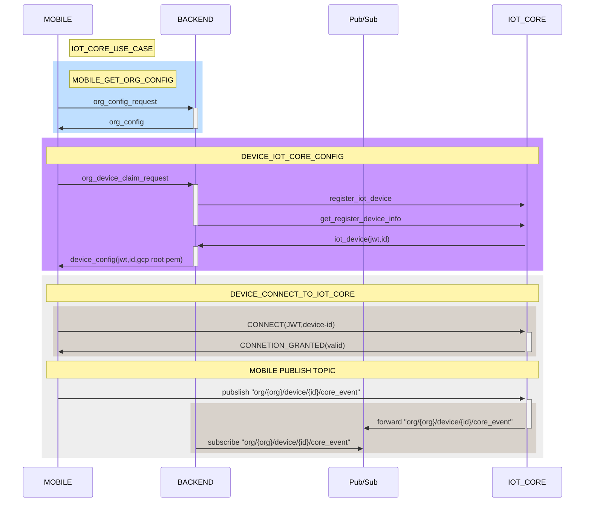

# gateway-proof-of-concept


how to run proof-of-concept

##### Folder structure

1. ```[aedes_mqtt_server](./aedes_mqtt_server/)```

Test out ours backend MQTT library

2. ```[dart_mqtt_client](./dart_mqtt_client/)```

Test out Dart MQTT client compatible with MQTT Broker made by aedes (MOSA), client and broker are able to comunicate publish and subscribe topic, client connection status (online, offline) has been proved to be working.

3. ```[poc_tflite_and_qr](./poc_tflite_and_qr/)``` **```ONLY RUN WITH REAL DEVICE```**

Tested with android, ios devices (Iphone 6s, 12 - Nokia C20)
Flutter running ```tensorflow lite``` inter with ```camera package```, ```google_ml_kit``` (prove of concept flutter framework able to run those task and not crashing)


##### How to run mockup
```
#aedes_mqtt_server
cd aedes_mqtt_server
node index.js

#dart_mqtt_client
cd dart_mqtt_client
dart run

#poc_tflite_and_qr
cd poc_tflite_and_qr
^Noted: only run with real device
flutter app => pub get, flutter run
```

IOT CORE sequenceDiagram concept

