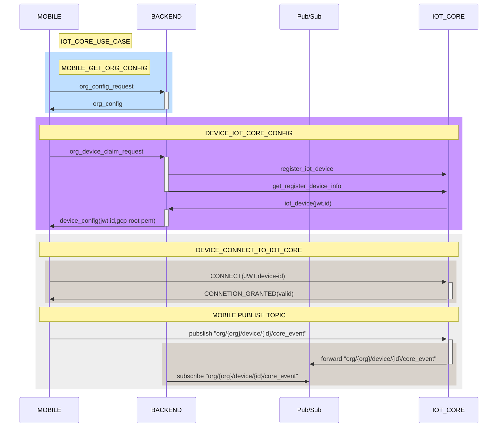

# gateway-proof-of-concept


how to run proof-of-concept

```
#aedes_mqtt_server
cd aedes_mqtt_server
node index.js

#dart_mqtt_client
cd dart_mqtt_client
dart run
```

IOT CORE sequenceDiagram concept

